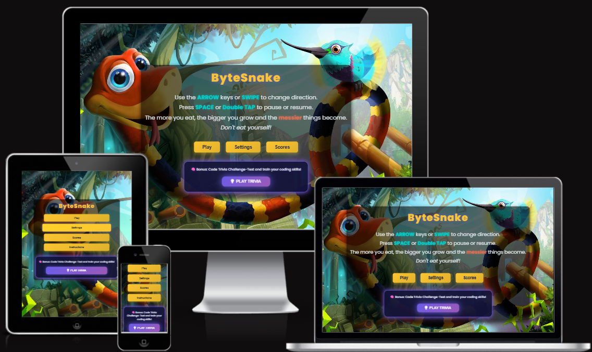
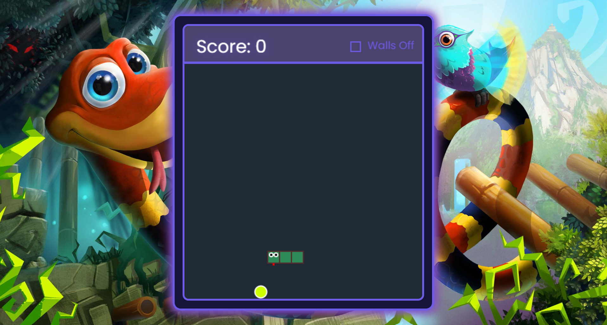
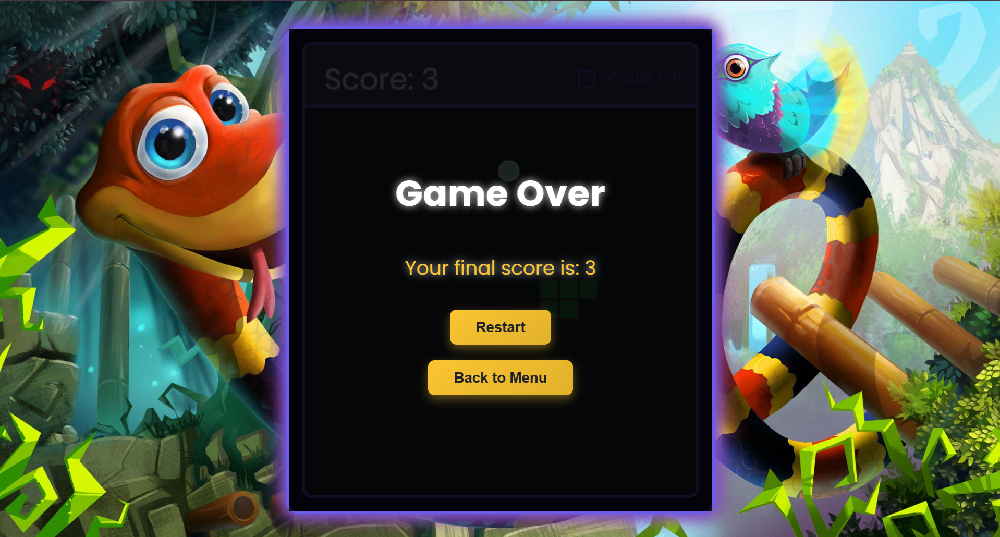
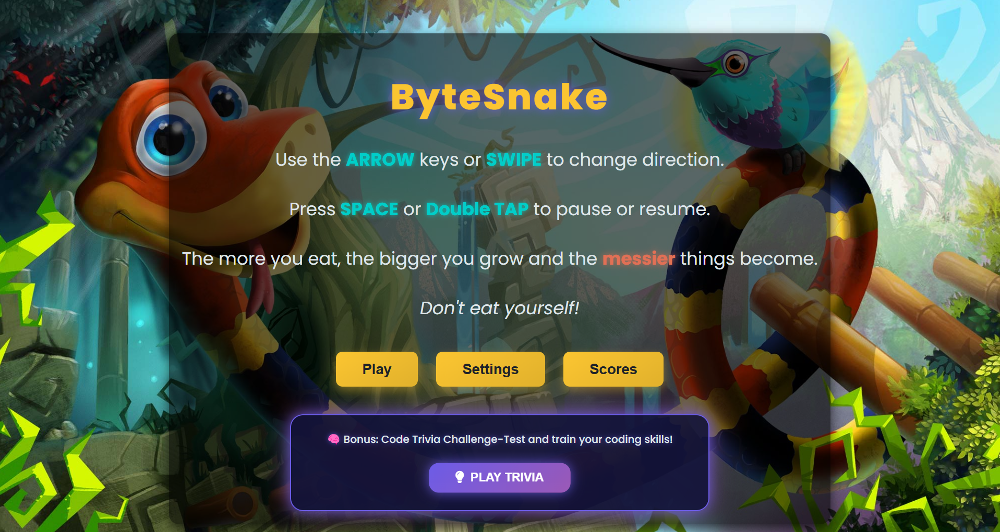
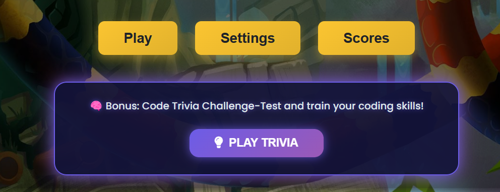
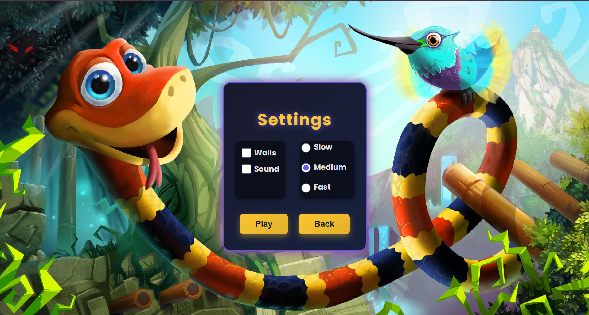
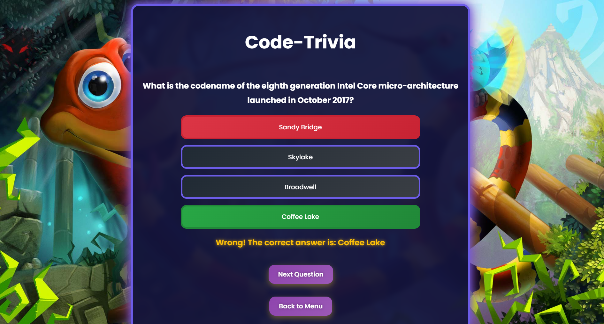
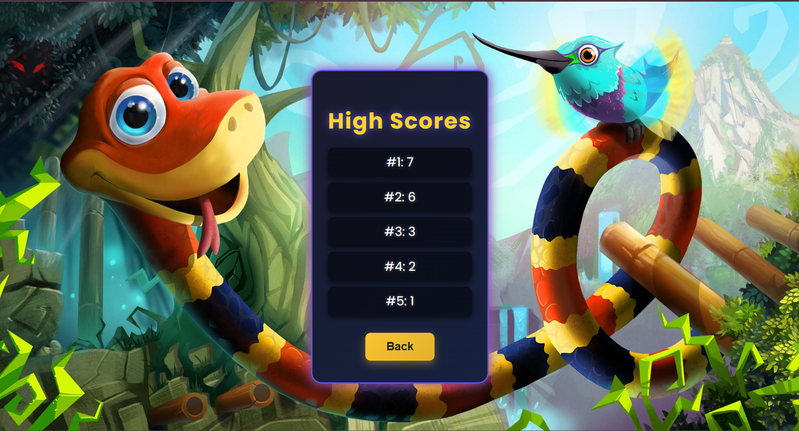
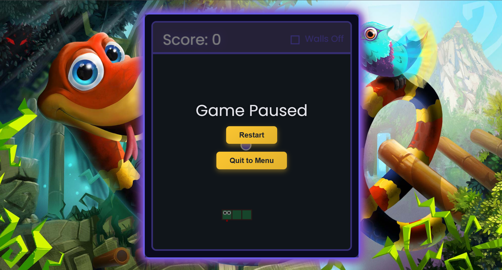
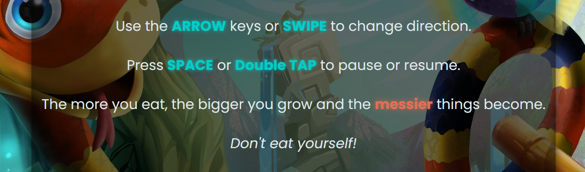

# 🎮 **ByteSnake**  



**Play the Game Live Here** 👉 [ByteSnake Live](https://danut89.github.io/Project-Milestone-2-Snake/)


## Table of Contents

- [About](#about)
  - [Site Contents](#site-contents)
  - [Project Purpose](#project-purpose)
  - [Target Audience](#target-audience)
- [Features](#features)
  - [Game Area](#game-area)
  - [Main Menu](#main-menu)
  - [Settings](#settings)
  - [Trivia Challenge](#trivia-challenge)
  - [High Scores](#high-scores)
  - [Pause and Resume](#pause-and-resume)
  - [Accessibility Features](#accessibility-features)
  - [Developer-Focused Features](#developer-focused-features)
- [UX](#ux)
  - [Overview](#overview)
- [Accessibility](#accessibility)
- [User Stories](#user-stories)
  - [As a Player](#as-a-player)
  - [As a Player with Accessibility Needs](#as-a-player-with-accessibility-needs)
  - [As a Developer/Contributor](#as-a-developercontributor)
- [Design Choices](#design-choices)
  - [Colours](#colours)
  - [Fonts](#fonts)
  - [Animations](#animations)
  - [Responsive Design](#responsive-design)
  - [Iconography](#iconography)
  - [Design Summary](#design-summary)
- [Wireframes](#wireframes)
  - [Main Menu](#1-main-menu-wireframes)
  - [Game Area](#2-game-area-wireframes)
  - [Settings Menu](#3-settings-menu-wireframes)
  - [High Scores Menu](#4-high-scores-menu-wireframes)
  - [Trivia Game](#5-trivia-game-wireframes)
  - [Pause and Resume Screen](#6-pause-and-resume-screen-wireframes)
  - [Game Over Screen](#7-game-over-screen-wireframes)
  - [Wireframes Explanation](#summary)
- [API Integration](#api-integration)
- [Technologies Used](#technologies-used)
  - [Core Development Tools](#core-development-tools)
  - [APIs and Libraries](#apis-and-libraries)
  - [Development Environments](#development-environments)
  - [Version Control](#version-control)
  - [Testing Tools](#testing-tools)
  - [Design and Media](#design-and-media)
- [Bug Fixes](#bug-fixes)
  - [1. Missing Top Border When Walls Are Enabled](#1-bug-missing-top-border-when-walls-are-enabled)
  - [2. Food Overlapping Snake](#2-bug-food-overlapping-snake)
  - [3. Sparks Defaulting to White](#3-bug-sparks-defaulting-to-white-or-causing-errors)
- [Deployment](#deployment)
  - [How to Deploy](#how-to-deploy)
  - [How to Run Locally](#how-to-run-locally)
  - [Troubleshooting](#troubleshooting)
- [Credits](#credits)
  - [Tutorials and Inspiration](#tutorials-and-inspiration)
  - [Code Adapted from Other Sources](#code-adapted-from-other-sources)
  - [Audio and Visual Content](#audio-and-visual-content)
  - [Acknowledgments](#acknowledgments)

---

## About

**ByteSnake** is a modern reimagining of the classic Snake game, blending fun gameplay with an educational twist. Players can enjoy the nostalgic Snake experience while also testing and improving their coding knowledge through an integrated trivia challenge.

This project balances **entertainment** with **learning**, providing features like customizable game options, touch controls, and a visually appealing design. Whether you’re chasing a high score or brushing up on coding concepts, ByteSnake has something for everyone.

---

### Site Contents

- **ByteSnake Game**: A fun, interactive Snake game featuring a trivia challenge to test coding knowledge.
- **Game Instructions**: Clear instructions to help players understand controls and gameplay.
- **Trivia Challenge**: An educational quiz designed to help players improve coding skills while playing.
- **High Scores Table**: A dynamic scoreboard to track and compare achievements.

---

### Project Purpose

The purpose of **ByteSnake** is to provide a nostalgic, accessible, and educational experience. By combining a classic Snake game with a code-based trivia challenge, ByteSnake encourages fun and learning simultaneously.

Key objectives:
- Offer an engaging and user-friendly game with intuitive controls.
- Provide educational value through the integrated coding trivia feature.
- Support accessibility for all users with responsive design and simple navigation.
- Deliver replayability through dynamic challenges and high-score tracking.

---

### Target Audience

- **Casual Players**: Those looking for a fun and nostalgic Snake game.
- **Learners**: Individuals interested in testing and expanding their coding knowledge.
- **Students**: A fun educational tool for coding enthusiasts.
- **Tech Enthusiasts**: Users who enjoy classic games enhanced with modern features.

---

## UX

### Overview

The design and functionality of **ByteSnake** are driven by the following goals:

- **Mobile-Friendly**: Responsive design with touch controls for mobile users.
- **Educational Value**: Integrated **Code Trivia Challenge** for coding enthusiasts.
- **Simplicity**: Intuitive gameplay mechanics and clear navigation.
- **Accessibility**: High contrast visuals, clear text, and keyboard-friendly navigation.
- **Interactive Experience**: Smooth animations, sound effects, and crisp controls.
- **Replayability**: High-score tracking and adjustable difficulty levels.
- **Modern Aesthetics**: Clean, vibrant visuals and responsive layouts.

---

## Accessibility

The game has been developed with accessibility in mind to ensure it provides a positive and inclusive experience for all users. 

### This has been achieved by:
- **Semantic HTML**: Proper use of semantic tags (e.g., `<header>`, `<section>`, `<button>`) to improve screen reader navigation.
- **High Contrast Design**: Use of clear fonts, distinct colors, and high contrast visuals for better readability.
- **Keyboard Navigation**: All features, including game controls and menu navigation, are accessible via keyboard inputs.
- **aria-labels for Interactive Features**: Aria-label attributes are used to provide clear descriptions for interactive elements like buttons.
- **Responsive Design**: The game adapts seamlessly to all screen sizes, including mobile devices.
- **Focus States**: Visual indicators ensure users know which element is currently active during navigation.

By prioritizing accessibility, **ByteSnake** ensures an engaging and enjoyable experience for players of all abilities.

---

## User Stories

### As a Player

1. **As a Player, I want to start the Snake game easily,**  
   *so that I can play without complicated instructions or setup.*

2. **As a Player, I want clear instructions on how to play,**  
   *so that I can understand the controls and game mechanics.*

3. **As a Player, I want the option to pause and resume the game,**  
   *so that I can take a break or stop playing without losing my progress.*

4. **As a Player, I want to see my score at the end,**  
   *so that I can track my progress and improve over time.*

5. **As a Player, I want to test my coding knowledge in the trivia challenge,**  
   *so that I can enjoy an educational feature alongside the game.*

---

### As a Player with Accessibility Needs

6. **I want the game to be keyboard accessible**  
   *so that I can play without relying on a mouse or touch screen.*

7. **I want clear and readable text**  
   *so that I can follow the game instructions without confusion.*

8. **I want high-contrast visuals**  
   *so that I can easily differentiate between game elements.*

9. **I want buttons and controls to have proper focus states**  
   *so that I know where I am while navigating the game.*

---

### As a Developer/Contributor

10. **I want clean and organized code**  
   *so that I can understand and maintain the project easily.*

11. **I want modular JavaScript functions**  
   *so that the code is reusable and easy to debug.*

12. **I want the game to follow accessibility best practices**  
   *so that it is inclusive to all users.*

13. **I want the README to document all game features**  
   *so that others can understand and contribute to the project.*

---
## Design Choices

### Colours
The following colors have been carefully chosen to balance aesthetics, usability, and accessibility for **ByteSnake**.

#### General Interface Colours  
The following colors are used consistently throughout the interface to enhance readability and provide a modern aesthetic:

-  `#ffffff` - White (General text, score display)
-  `#242423` - Deep Dark Gray (Main background elements)
-  `#dfe6e9` - Soft Neutral Gray (Text highlights)
-  `#dcdde1` - Light Gray (Options menu text)
-  `#4b426e` - Dark Purple (Score area background)
-  `#202a34` - Dark Blue (Game board background)


### Buttons and Interactive Elements  
The following colors are used to enhance interactivity and ensure a visually engaging experience for users:

-  `#fbc531` - Warm Yellow (Main buttons and highlights)
-  `#ffd32a` - Bright Yellow (Hover effect for buttons)
-  `#6c5ce7` - Neon Purple (Borders, glowing effects)
-  `#e74c3c` - Red (Close button background)
-  `#00cec9` - Aqua Blue (Highlighted instructions text)
-  `#e17055` - Orange Red (Messy text shadow)


### Game Elements  
These colors define the key game components, ensuring clarity, consistency, and engagement for players:

-  `#f9ca24` - Yellow (Walls when enabled)
-  `#2E8B57` - Snake Color
-  `#502c2e` - Snake Border Color
-  `#DC3545` - Trivia wrong answer highlight
-  `#28A745` - Trivia correct answer highlight


#### Food & Sparks
The food and spark effects in **ByteSnake** use a predefined color array to create vibrant and dynamic visuals. These colors enhance the game's aesthetic and give it a modern, cyber-inspired feel.
These colors are randomly selected from the array to create dynamic visuals:
- **Food**: Each new food item appears in a random color from this array.
- **Sparks**: When food is eaten, sparks are generated using the same color as the food to provide a satisfying visual feedback.

The combination of these vibrant colors gives the game an energetic and visually appealing experience.

**Color Array:**
-  `#ff355e` - Radical Red
-  `#fd5b78` - Wild Watermelon
-  `#ff6037` - Outrageous Orange
-  `#ff9966` - Atomic Tangerine
-  `#ff9933` - Neon Carrot
-  `#ffcc33` - Sunglow
-  `#ffff66` - Laser Lemon
-  `#ccff00` - Electric Lime
-  `#66ff66` - Screamin' Green
-  `#aaf0d1` - Magic Mint
-  `#50bfe6` - Blizzard Blue


### Trivia and Overlays  
These colors enhance the visual appeal and interactivity of the trivia section and overlays, ensuring a futuristic and engaging design:

-  `#8e44ad` - Dark Neon Purple (Trivia container border, glowing effects)
-  `#9b59b6` - Purple Gradient (Trivia highlights)
-  `#34495e` - Dark Blue Gradient (Trivia background)


### Fonts
The fonts used in **ByteSnake** are chosen for clarity, modern aesthetics, and a blend of nostalgic appeal:

1. **Poppins**  
   - Used for all headings, buttons, and general UI text.
   - Clean and modern sans-serif font for an elegant look.

2. **Roboto Mono**  
   - Applied for trivia questions and code-related text.
   - Provides a clear, monospaced font ideal for coding themes.

All fonts are sourced from [Google Fonts](https://fonts.google.com).


### Animations  
Animations play a crucial role in making the game visually appealing and engaging:  
- **Pulse Effects**: Buttons feature subtle pulsing animations to draw attention.  
- **Glow Effects**: Applied to buttons, and trivia sections using `box-shadow` and keyframe animations.
- **Smooth Transitions**: Menus and overlays feature fade-in animations for seamless transitions.  
- **Hover Effects**: Buttons scale and change colors on hover for interactive feedback.
- **Animated Backgrounds**: Subtle gradient backgrounds and glowing effects for a futuristic aesthetic.


### Responsive Design  
The game offers a seamless experience on all devices:  
- **Scaling**: Adjusts layouts and fonts for desktop, tablet, and mobile screens.  
- **Touch Controls**: Mobile users can swipe or double-tap to control the game.  
- **Optimized Layouts**: Compact menus and buttons for better usability on smaller screens.  


### Iconography  
Icons are used to enhance clarity and usability:  
- **Font Awesome Icons**: Add visual cues in menus and the trivia bonus section.  
- **Wall Mode Icons**: Visual representation of walls being enabled or disabled.  


### Design Summary
The **design choices** for ByteSnake focus on:
- **Vibrant Colours**: For an energetic and modern appearance.
- **Dynamic Visuals**: Sparks and food effects provide satisfying feedback.
- **Readable Fonts**: Modern, clean typography enhances usability.
- **Subtle Audio Effects**: Balanced sounds to avoid distraction and maintain immersion.

This section highlights the design philosophy behind **ByteSnake**, emphasizing a combination of usability, accessibility, and modern aesthetics to deliver a polished **visually appealing**, **user-friendly**, and **engaging** game experience that stands out.


## **Features**

 ### **Game Area**
- **Interactive Game Canvas**  
  - The game is displayed on an interactive canvas where the snake moves dynamically, eating food, and growing longer.  
  - Players navigate the snake using arrow keys or swipe gestures.  
  - The food appears randomly and features sparks with vibrant colors when consumed.  
  - **User Stories Covered:** 1, 2, 6, 8  

<details>
<summary>Screenshoot Game-Area</summary>



</details>

---

- **Game Over Screen**  
  - When the game ends, the player is presented with their final score.  
  - Includes a Restart button for quick replay and a Back to Menu button for easy navigation.  
  - **User Stories Covered:** 3, 4  
<details>
<summary>Screenshoot Game-Over</summary>




</details>

---

### **Main Menu**
- **Desktop Menu Options**  
  - A clean and intuitive menu that provides access to:  
    - Play Game: Starts the classic snake game.  
    - Options: Allows customization of gameplay features.  
    - High Scores: Displays a table of the highest scores.  
    - Trivia Challenge: Launches an educational coding trivia game. 
    - **Instructions Button (Mobile Only):**  
    - On mobile devices, an **Instructions** button appears in the main menu.  
    - Opens a modal with clear gameplay instructions.  
    - Allows users to understand the game without cluttering the main screen. 
    - **User Stories Covered:** 1, 2, 5  

<details>
<summary>Screenshoot Main-Menu</summary>



</details>

### **Mobile Menu Options**  

- On mobile devices, the menu is optimized to provide better usability with a smaller screen:

- **Instructions Button:**  
  - A dedicated **Instructions** button is provided on the main menu.  
  - Opens a modal with clear gameplay instructions, including game controls and mechanics.  
  - Ensures that the instructions remain accessible without cluttering the smaller screen.  

- **Menu Options:**  
  Similar to the desktop version, mobile users can access:  
  - **Play Game:** Starts the snake game.  
  - **Options:** Adjust gameplay settings.  
  - **High Scores:** View the top scores.  
  - **Trivia Challenge:** Test your coding knowledge.  
  - **User Stories Covered:** 2, 7, 8.
 
 <details>
<summary>Screenshoot Mobile Main-Menu</summary>


</details>

<details>
<summary>Screenshoot Mobile Instructions-Modal</summary>


</details>

---

- **Animated Buttons**  
  - Buttons are visually engaging with glowing hover effects and smooth animations.  
  - **User Stories Covered:** 8, 9  
<details>
<summary>Screenshoot Buttons</summary>




</details>

---

### **Settings**
- **Wall Mode**  
  - Enable or disable walls to increase or decrease difficulty.  
  - Visual cues indicate whether the walls are on or off.  

- **Speed Adjustment**  
  - Players can select from three speed options: Slow, Medium, or Fast.  

- **Sound Effects**  
  - Enable or disable sound effects such as button clicks, food consumption, and game over sounds.  
  - **User Stories Covered:** 3, 7, 9  
<details>
<summary>Screenshoot Settings-Menu</summary>



</details>

---

### **Trivia Challenge**
- **Educational Gameplay**  
  - A separate trivia game mode tests the player's coding knowledge with multiple-choice or true/false questions.  
  - The Trivia Challenge uses the Open Trivia Database API to fetch random coding-related questions in real-time.
  - Randomized questions and answers ensure replayability.  
  - **User Stories Covered:** 5, 12  

- **Real-Time Feedback**  
  - Correct answers are highlighted in green, and incorrect answers in red, with a message indicating the correct answer.  
  - **User Stories Covered:** 5, 9  

<details>
<summary>Screenshoot Trivia-Game</summary>



</details>

- **Real-Time Feedback**:  
  - Correct answers are highlighted in green, and incorrect answers in red, with a message indicating the correct answer.


**User Stories Covered**: 9, 14.

---

### **High Scores**
- **Score Table**  
  - Displays the top scores to encourage replayability and competition.  
  - Players can track their personal bests.  
  - **User Stories Covered:** 4, 5  

<details>
<summary>Show Screenshot</summary>



</details>

---

### **Pause and Resume**
- **Pause Overlay**  
  - Players can pause the game using the spacebar or a double tap.  
  - The pause overlay provides options to Resume, Restart, or Quit to Menu.  
  - **User Stories Covered:** 3, 6  


<details>
<summary>Screenshot Pause-Game</summary>



</details>

---

### **Accessibility Features**
- **Keyboard and Touch Controls**  
  - Supports both keyboard and swipe gestures for navigation.  
  - **User Stories Covered:** 6, 8  

- **Readable Text and Contrasting Colors**  
  - High-contrast visuals and large, clear fonts improve usability for all players.  
  - **User Stories Covered:** 7, 8  

- **Responsive Design**  
  - The game adapts seamlessly to various screen sizes, including desktops, tablets, and mobile devices.  
  - **User Stories Covered:** 8, 9 

<details>
<summary>Screenshot Accesibility</summary>



</details>

---

### **Developer-Focused Features**
- **Clean and Modular Code**  
  - The project follows a clean and organized code structure to ensure readability and maintainability.  
  - JavaScript functions are modular for better reusability and debugging.  
  - **User Stories Covered:** 10, 11

  ---

  - **Accessibility Best Practices**  
  - The game implements accessibility best practices to ensure inclusivity for all users.  
  - **User Stories Covered:** 12, 13  

  ---

## Wireframes

The following wireframes illustrate the layout and structure of the game’s key screens. Mobile wireframes are provided only for the Main Menu, as the other screens maintain the same layout across devices.

---

### **1. Main Menu Wireframes**

The main menu includes options to:  
- Start the game  
- Access settings  
- View high scores  
- Play the trivia challenge  

**Desktop Version**  
<details>
<summary>View Desktop Wireframe</summary>


</details>  

---

**Mobile Version**  
<details>
<summary>View Mobile Wireframe</summary>


</details>  

---

### **2. Game Area Wireframes**

The Game Area includes:  
- Snake movement on the canvas  
- Food elements appearing randomly  
- Score display and game interactions  

**Desktop Version**  
<details>
<summary>View Desktop Wireframe</summary>


</details>  

---

**Mobile Version**  
<details>
<summary>View Mobile Wireframe</summary>


</details>

---

### **3. Settings Menu Wireframes**

The settings menu allows players to customize the game:  
- Toggle Wall Mode  
- Adjust Snake Speed  
- Enable/Disable Sound Effects  

**Desktop Version**  
<details>
<summary>View Desktop Wireframe</summary>


</details>  

---

### **4. High Scores Menu Wireframes**

Displays the high scores table with a clean and structured layout.

**Desktop Version**  
<details>
<summary>View Desktop Wireframe</summary>


</details>  

---

### **5. Trivia Game Wireframes**

The trivia challenge presents randomized coding questions and provides real-time feedback.

**Desktop Version**  
<details>
<summary>View Desktop Wireframe</summary>


</details>  

---

### **6. Pause and Resume Screen Wireframes**

The pause screen provides options to:  
- Resume the game  
- Restart the game  
- Quit to Main Menu  

**Desktop Version**  
<details>
<summary>View Desktop Wireframe</summary>


</details>  

---

### **7. Game Over Screen Wireframes**

Displays the final score and options to restart the game or return to the Main Menu.

**Desktop Version**  
<details>
<summary>View Desktop Wireframe</summary>


</details>  

---

### **Summary**

- While a mobile version of the Main Menu wireframe and Game-Area wireframe are  included to highlight their adjusted layout, additional mobile wireframes for other features (e.g., Settings Menu, High Scores, Trivia Game, Pause Screen, and Game Over Screen) were not necessary. These screens maintain a consistent layout and visual appearance across desktop and mobile devices, with responsive design ensuring proper scaling and usability on smaller screens.

- These wireframes were created to ensure a clear and consistent user experience. The game was designed with a responsive layout to maintain usability across devices while focusing on simplicity and accessibility.

---

  ## API Integration

### Open Trivia Database API
The game uses the **Open Trivia Database API** to power the Trivia Challenge feature. This API provides random multiple-choice coding questions, ensuring a fresh and educational experience for players.

**API Endpoint:**
- [Open Trivia Database](https://opentdb.com/api_config.php)

### How It Works
1. **Fetching Questions**:  
   - Questions are fetched dynamically using JavaScript's `fetch()` method.  
   - API responses return a set of randomized questions with both correct and incorrect answers.  

2. **Randomized Display**:  
   - Answers are shuffled to provide a challenging and fair experience.  

3. **Real-Time Feedback**:  
   - Correct answers are highlighted in green.  
   - Incorrect answers are highlighted in red, and the correct answer is displayed to the player.

**Code Example:**
```javascript
// Fetch trivia questions from Open Trivia Database
fetch('https://opentdb.com/api.php?amount=10&category=18&type=multiple')
    .then(response => response.json())
    .then(data => {
        const questionData = data.results[0];
        displayTriviaQuestion(questionData);
    })
    .catch(error => console.error('Error fetching trivia:', error));
```

### **Future Development**

While the current version of **ByteSnake** delivers engaging gameplay and educational content, we envision expanding its features in future updates to enhance the experience further. These include:

1. **Additional Game Modes**:
   - Introduce various game modes, such as:
     - **Time Attack**: Players race against the clock to achieve the highest score.
     - **Survival Mode**: Obstacles and hazards appear on the game board to challenge players.
     - **Zen Mode**: A relaxed, endless mode without losing conditions.

2. **Trivia Power-Ups**:
   - Transform the trivia challenge into an in-game power-up.
   - Correct trivia answers would provide benefits like:
     - Speed boosts.
     - Bonus points.
     - Temporary invincibility against walls or collisions.

3. **Custom Skins**:
   - Allow players to unlock or select custom snake and food designs for a personalized experience.

These features aim to provide a more dynamic and versatile gaming experience while retaining the educational aspect of the trivia challenge.

---

## Technologies Used

The following tools, technologies, and libraries were used to develop and test the game:

### Core Development Tools
- **HTML5 Canvas**: Used for rendering the game area and interactive visuals.
- **CSS3**: Provides styling, layout design, and responsive visuals for the game.
- **JavaScript (ES6+)**: Manages game logic, interactivity, and dynamic rendering.

### APIs and Libraries
- **[Open Trivia Database API](https://opentdb.com/api_config.php)**: Supplies real-time coding trivia questions for the Trivia Challenge feature.
- **[Hammer.js](https://hammerjs.github.io/)**: Enables swipe gesture controls on mobile devices.
- **[Font Awesome](https://fontawesome.com/)**: Provides icons for buttons and additional visual elements.
- **[Google Fonts](https://fonts.google.com/)**: Used for custom typography, including fonts like 'Poppins' and 'Roboto Mono'.

### Development Environments
- **[GitPod](https://www.gitpod.io/)**: Cloud-based development environment used for coding and testing the game.
- **[Visual Studio Code](https://code.visualstudio.com/)**: Local code editor used for initial development and debugging.

### Version Control
- **[Git](https://git-scm.com/)**: Used for version control to track changes and manage project history.
- **[GitHub](https://github.com/)**: Hosted the project repository for collaboration and code storage.
- **[GitHub Pages](https://pages.github.com/)**: Deployed the game for easy access and sharing.

### Testing Tools
- **Browser Developer Tools**: Used for real-time testing, debugging, and ensuring responsiveness on different screen sizes.
- **[Lighthouse](https://developers.google.com/web/tools/lighthouse)**: Ensured accessibility, performance, and SEO compliance.
- **[W3C JSLint Validator](https://jslint.com/)**: Validated the JavaScript code for syntax and best practices compliance.
- **[ChatGPT](https://openai.com/chatgpt)**: Assisted in testing, debugging, and improving game logic and design.
- **[wave](https://wave.webaim.org/)**: Used for testing, performance and contrast errors.


### Design and Media
- **[TinyPNG](https://tinypng.com/)**: Optimized and resized images for better performance and loading times.
- **Online Image Resources**: High-quality game images used for backgrounds and visual elements.

### Additional Tools
- **[WAVE Accessibility Tool](https://wave.webaim.org/)**: Verified the game's accessibility compliance.
- **Markdown Editor**: Used to draft and structure the project’s README file.

---

## 🐛 Bug Section

### 1. Bug: Missing Top Border When Walls Are Enabled
**Description:**  
When the "Walls" option was enabled, a yellow border was displayed around the game area to indicate the walls. However, the top border (directly beneath the score header) was missing, causing the wall to appear incomplete.


#### Steps to Reproduce:
1. Start the game and enable the "Walls" option in the options menu.
2. Observe the game board—yellow borders appear on the sides and bottom, but the top border under the score header is missing.


#### Cause:
The top border was not being drawn explicitly as part of the game canvas rendering. The border logic did not account for the area beneath the score header.


#### Resolution:
To resolve the issue:
1. Added a block in the `drawGame` function to explicitly draw a 3px border under the score header.
2. Dynamically updated the border color based on the "Walls" state:
   - Yellow (`#f9ca24`) when walls are enabled.
   - Dark gray (`#2C2C42`) when walls are disabled.

---

#### Relevant Code Snippet:
**Before Fixing:**
```javascript
gameCtx.fillStyle = "white";
gameCtx.font = "40px Verdana";
gameCtx.fillText(score, tileSize, tileSize * 2.25); // Draw the score
```

**After Fixing:**
```javascript
// Draw the 3px border under the header
if (wallsEnabled) {
    gameCtx.fillStyle = "#f9ca24"; // Yellow border for walls enabled
} else {
    gameCtx.fillStyle = "#2C2C42"; // Green neon background color for walls disabled
}
gameCtx.fillRect(0, tileSize * 3, gameCanvas.width, 3); // Draw the border
```
---

### 2. Bug: Food Overlapping Snake
**Description:**  
The food sometimes spawned on a segment of the snake’s body, making it impossible for the player to collect it. This resulted in a frustrating gameplay experience.

#### Steps to Reproduce:
1. Play the game until the snake grows larger.
2. Observe that food may occasionally spawn on top of the snake's body.


#### Cause:
The function responsible for generating the food position (`generateNewFood`) did not check if the generated position overlapped with the snake’s segments.


#### Resolution:
To fix this issue:
1. Added a **check for overlap** between the food position and the snake's body.
2. Used a `do...while` loop to ensure the food position is valid (not overlapping) before assigning it.


#### Relevant Code Snippet:
**Before Fixing:**
```javascript
function generateNewFood() {
    foodPosition = { 
        x: Math.floor(Math.random() * 20) * tileSize, 
        y: Math.floor(Math.random() * 20 + 3) * tileSize 
    };
    foodColor = colorArray[Math.floor(Math.random() * colorArray.length)];
}
```
**After Fixing:**
```javascript
function generateNewFood() {
    let isOverlapping;

    do {
        // Generate random food position
        foodPosition = { 
            x: Math.floor(Math.random() * 20) * tileSize, 
            y: Math.floor(Math.random() * 20 + 3) * tileSize 
        };

        // Check if food position overlaps with the snake
        isOverlapping = snake.some(segment => segment.x === foodPosition.x && segment.y === foodPosition.y);

    } while (isOverlapping); // Repeat until a valid position is found

    // Assign a random color to the food
    foodColor = colorArray[Math.floor(Math.random() * colorArray.length)];
}
```
---

## 3. Bug: Sparks Defaulting to White or Causing Errors

### Issue:
The sparks that appear when the snake eats food were either defaulting to white (when `foodColor` was `null`) or causing an error in the console. This issue occurred because the `foodColor` variable was initialized as `null` and was not assigned a valid value before `generateSparks` was called the first time.

### Error Message:
```plaintext
Uncaught TypeError: Cannot read properties of null (reading 'replace')
```

### Cause:
- `foodColor` was not properly assigned before the `generateSparks` function was called.
- The `generateSparks` function expected a valid color but received `null` on the first call.

### Fix: Adding a Fallback for `foodColor`

To ensure the sparks always have a valid color, i implemented two changes:
1. Added a fallback value for `foodColor` inside the `generateNewFood` function to guarantee it always has a default color.
2. Updated the `generateSparks` function to check for and handle `null` values with a fallback color (white).


### Before Code

#### 1. `generateNewFood` (No Fallback for `foodColor`):
```javascript
function generateNewFood() {
    let isOverlapping;

    do {
        foodPosition = { 
            x: Math.floor(Math.random() * 20) * tileSize, 
            y: Math.floor(Math.random() * 20 + 3) * tileSize 
        };

        isOverlapping = snake.some(segment => segment.x === foodPosition.x && segment.y === foodPosition.y);
    } while (isOverlapping);

    // Assign a random color to the food
    foodColor = colorArray[Math.floor(Math.random() * colorArray.length)];
}
```

#### 2. `generateSparks` (No Check for `null`):
```javascript
function generateSparks(x, y, color) {
    for (let i = 0; i < 30; i++) {
        const angle = Math.random() * 2 * Math.PI;
        const speed = randomNumber(1, 3);
        const dx = Math.cos(angle) * speed;
        const dy = Math.sin(angle) * speed;
        sparks.push(new Spark(x, y, dx, dy, color)); // Error if color is null
    }
}
```


### After Code

#### 1. `generateNewFood` (Added Fallback for `foodColor`):
```javascript
function generateNewFood() {
    let isOverlapping;

    do {
        foodPosition = { 
            x: Math.floor(Math.random() * 20) * tileSize, 
            y: Math.floor(Math.random() * 20 + 3) * tileSize 
        };

        isOverlapping = snake.some(segment => segment.x === foodPosition.x && segment.y === foodPosition.y);
    } while (isOverlapping);

    // Ensure foodColor is always valid
    foodColor = colorArray[Math.floor(Math.random() * colorArray.length)] || "rgba(255, 255, 255, 1)";
}
```

#### 2. `generateSparks` (Added Fallback for `color`):
```javascript
function generateSparks(x, y, color) {
    if (!color) {
        color = "rgba(255, 255, 255, 1)"; // Default to white
    }
    for (let i = 0; i < 30; i++) {
        const angle = Math.random() * 2 * Math.PI;
        const speed = randomNumber(1, 3);
        const dx = Math.cos(angle) * speed;
        const dy = Math.sin(angle) * speed;
        sparks.push(new Spark(x, y, dx, dy, color));
    }
}
```


### Results

- **First Food:** Sparks default to white on the first food eaten (since `foodColor` is `null` at the beginning).
- **Subsequent Foods:** Sparks correctly match the color of the food eaten.
- **No Errors:** The error (`Cannot read properties of null`) is no longer thrown in the console.


### Conclusion

This fix ensures that the sparks always have a valid color, even in edge cases. The game now provides a consistent visual effect when the snake eats food, enhancing the user experience.

## Bug Fix Log  

| **Bug**                          | **Description**                                 | **Fix Applied**                     |
|----------------------------------|-----------------------------------------------|-------------------------------------|
| **Screen Flicker on Pause**      | Screen flickered briefly when resuming game.  | Fixed by optimizing `requestAnimationFrame`. |
| **Score Not Updating**           | Final score did not display correctly.        | Corrected score logic in `game.js`. |
| **Snake Collision Issue**        | Snake didn’t detect collision with itself.    | Fixed by adding self-collision checks. |

---

## Deployment  

The project has been deployed using **GitHub Pages** and is hosted on the live link below:  

**[Play the Game Here](https://danut89.github.io/Project-Milestone-2-Snake/)**  

---

### How to Deploy  

To deploy this project using **GitHub Pages** from its GitHub repository, the following steps were taken:  

1. Navigate to your GitHub repository.  
2. From the top menu, select **Settings**.  
3. Scroll down to the **GitHub Pages** section.  
4. Under **Source**, click the dropdown menu labeled **None** and select **Main Branch** (or `master` depending on your branch name).  
5. Click **Save** (if required).  
6. Once saved, GitHub automatically deploys the project.  

> **Note:** It may take a few minutes for the site to go live. Refresh the page, and the **GitHub Pages** section will show the link to your deployed website.

---

### How to Run Locally  

To clone and run this project locally, follow these steps:

1. Go to the project's GitHub repository:  
   **[GitHub Repository Link](https://github.com/danut89/Project-Milestone-2-Snake)**  

2. Under the repository name, click the green **Code** button and copy the HTTPS URL: https://github.com/danut89/Project-Milestone-2-Snake.git

3. Open your local terminal (Command Prompt, Git Bash, or IDE terminal).  

4. Navigate to the directory where you want to clone the project:  
```bash
cd your-directory-path
```
5. Clone the repository: git clone https://github.com/danut89/Project-Milestone-2-Snake.git

6. Open the project folder in your preferred code editor (e.g., VS Code).

7. To view the project in your browser, open the index.html file. Alternatively, use a live server (e.g., in VS Code install the Live Server extension):
- Right-click on index.html
- Select Open with Live Server

### Troubleshooting
- GitHub Pages Not Showing: Ensure the correct branch is selected under GitHub Pages settings. Clear your browser cache and refresh.
- Local Issues: Verify all project files are cloned properly. If necessary, run git pull to fetch the latest updates.
- For more detailed troubleshooting on cloning a repository, refer to the official GitHub documentation:
**[GitHub Docs: Cloning a repository](https://docs.github.com/en/repositories/creating-and-managing-repositories/cloning-a-repository)**  

---

## Credits  

### Tutorials and Inspiration  
The following tutorials and resources greatly contributed to the development of this game:  

- **YouTube Tutorials:**  
   - "Build a Snake Game Using JavaScript and HTML5 Canvas" by *Code Explained*. [Link to tutorial](https://www.youtube.com/watch?v=9TcU2C1AACw)
   - "Create Snake Game Step-by-Step Using Canvas" by *Coding With Mosh*. [Link to tutorial](https://www.youtube.com/watch?v=7Azlj0f9vas)
   - "Game Development with JavaScript" by *Traversy Media*. [Link to tutorial](https://www.youtube.com/watch?v=PA57h3mFHik)
   - "A game of Snake written in JavaScript" 🐍 by *Bro Code*. [Link to tutorial](https://www.youtube.com/watch?v=Je0B3nHhKmM)

- **Documentation:**  
   - [MDN Web Docs: Canvas API](https://developer.mozilla.org/en-US/docs/Web/API/Canvas_API)  
   - [MDN Web Docs: Game Loops and Animations](https://developer.mozilla.org/en-US/docs/Games/Techniques/Frame_rate)  

- **Other References:**  
   - W3Schools: [HTML Canvas Tutorial](https://www.w3schools.com/html/html5_canvas.asp)  
   - CSS-Tricks: [Centering in CSS](https://css-tricks.com/centering-css-complete-guide/)  

---

### Code Adapted from Other Sources  
The following code snippets were used, modified, or adapted in this project:  

- **Random Number Generator:** Function to generate a random number between two values.  
- **Game Loop Logic:** General game loop structure adapted from MDN Web Docs.  
- **Keyboard Input Handling:** Code to detect arrow keys for movement.  
- **Canvas Rendering Techniques:** Techniques for rendering shapes, text, and animations on the canvas.  

Where applicable, detailed credits and links to sources are provided directly in the code comments.  

---

### Audio and Visual Content  
- **Sound Effects:**  
   - *Food Collection Sound* sourced from [Freesound.org](https://freesound.org).  
   - *Button Click Sound* adapted from [Freesound.org](https://freesound.org). 
   - *Game Over Sound* sourced from  [Freesound.org](https://freesound.org). 

- **Background Image:**  
   - Sourced from an online resource. (Note: If you have the original link, it is best to include it here for proper attribution.)  

- **Visual Assets:**  
   - Button animations and interface elements were custom-designed for this project.   

---

### Acknowledgments  
Special thanks to the following for their support and tools:  
- **ChatGPT (OpenAI):** Assistance with debugging and brainstorming solutions.  
- **GitHub:** Version control and project hosting.  
- **Visual Studio Code:** Primary code editor for development.  
- **Gitpod:** Cloud-based coding environment for seamless development.  

Thank you to everyone who contributed to this project, whether directly or indirectly! 🚀  
