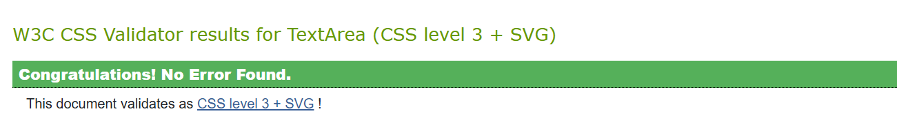

# 📋 **Testing Documentation**

# Table of Contents

1. [The principles of automated and manual testing](#the-principles-of-automated-and-manual-testing)

2. [Manual Testing](#manual-testing)
3. [Testing User Stories](#testing-user-stories)
   - [Player Stories](#1-as-a-player-i-want-to-start-the-snake-game-easily)
   - [Accessibility Stories](#6-as-a-player-with-accessibility-needs-i-want-the-game-to-be-keyboard-accessible)
   - [Developer Stories](#10-as-a-developercontributor-i-want-clean-and-organized-code)

4. [Automated Testing](#automated-testing)
   - [Accessibility and Performance](#1-accessibility-and-performance-testing)
   - [Code Validation](#2-code-validation)
   - [Browser Compatibility](#3-browser-compatibility)
   - [Responsiveness](#4-responsiveness)

5. [Testing Tools Used](#testing-tools-used)
   - [Future Testsing Plan](#future-testing-plans)
   - [User Feedback](#user-feedback)

---

## The principles of automated and manual testing

**Automated Testing:**  
Automated tests provide fast, repeatable, and consistent validation of our application's functionality. They are ideal for regression, performance, and load testing—scenarios where frequent, high-volume checks are needed and human error must be minimized. This approach is especially effective in CI/CD environments, where rapid feedback on code changes is crucial.

**Manual Testing:**  
Manual testing leverages human insight to explore and evaluate aspects that automated tests might overlook, such as usability and overall user experience. It is best used for exploratory testing, UI/UX assessments, and complex scenarios that require contextual judgment. This method ensures that the application not only works correctly but also meets real-world usability standards.

---

## Manual Testing

| **Feature**               | **Testing Method**                                                                 | **Expected Behavior**                                                                                        | **Response**                                                                                     | **Pass/Fail**       |
|---------------------------|-----------------------------------------------------------------------------------|--------------------------------------------------------------------------------------------------------------|--------------------------------------------------------------------------------------------------|---------------------|
| **Start Game**            | Click the "Play Game" button on the main menu.                                     | Game starts, snake appears on the canvas, ready to move.                                                     | Game started correctly, and snake was displayed on the canvas.                                  | ✅ **Pass**          |
| **Movement Controls**     | Use arrow keys or swipe gestures to move the snake.                               | Snake moves in the direction pressed without overlapping itself or walls (if walls enabled).                 | Snake moved smoothly with keyboard and swipe gestures.                                           | ✅ **Pass**          |
| **Pause and Resume**      | Press the spacebar or double-tap the screen to pause and resume the game.          | Game pauses, overlay appears. On resume, the game continues seamlessly.                                       | Pause and resume functionality worked correctly.                                                 | ✅ **Pass**          |
| **Food Collection**       | Move the snake to collect food.                                                   | Food disappears when eaten, snake grows, score increases, and sparks appear.                                 | Food collected successfully, snake grew, score updated, and sparks displayed correctly.          | ✅ **Pass**          |
| **Game Over**             | Run into the wall (if walls enabled) or the snake’s body.                         | Game stops, Game Over overlay appears, final score is displayed, and restart or back-to-menu options shown.  | Game Over overlay displayed correctly with score and buttons.                                    | ✅ **Pass**          |
| **Wall Mode**             | Enable or disable wall mode in the options menu.                                  | Walls are activated or deactivated, visual indicators change accordingly.                                     | Walls toggled successfully, with appropriate visual cues.                                        | ✅ **Pass**          |
| **Speed Adjustment**      | Select a speed (Slow, Medium, Fast) from the options menu.                        | Snake moves at the selected speed.                                                                           | Snake speed adjusted accurately based on the selection.                                          | ✅ **Pass**          |
| **Sound Effects**         | Enable or disable sound effects in the options menu.                              | Sound effects toggle correctly for food collection and game events.                                           | Sound effects were toggled on and off successfully.                                              | ✅ **Pass**          |
| **Trivia Challenge**      | Click the "Play Trivia" button from the main menu.                                | Trivia mode starts, questions and answers display correctly, feedback is provided for correct/incorrect answers. | Trivia mode loaded successfully, questions randomized, and feedback displayed.                   | ✅ **Pass**          |
| **High Scores**           | Navigate to the High Scores menu from the main menu.                              | High Scores table is displayed with correct formatting and scores.                                            | High Scores displayed correctly and updated after the game.                                      | ✅ **Pass**          |
| **Responsive Design**     | Test the game on various devices (desktop, tablet, mobile).                       | Game adapts correctly to different screen sizes and maintains usability.                                      | Game displayed correctly on all devices, maintaining accessibility and responsiveness.           | ✅ **Pass**          |
| **Instructions Button**   | Click the instructions button (mobile view).                                      | Modal opens with clear game instructions, can be closed via the close button or clicking outside.            | Instructions modal displayed and closed correctly.                                               | ✅ **Pass**          |
| **Accessibility**         | Use keyboard navigation to access menus and interact with game options.           | All interactive elements are accessible using keyboard (Tab, Enter).                                         | Menus and options were accessible with the keyboard.                                             | ✅ **Pass**          |
| **Animated Elements**     | Hover over buttons and check interactive animations.                              | Buttons display hover animations and transitions smoothly.                                                    | Hover animations worked as intended.                                                             | ✅ **Pass**          |

- This table documents the manual testing process, confirming that all features were tested and responded correctly. You can also include specific screenshots if needed.

**[Back to Top](#top)** 

---

## Testing User Stories

### 1. As a Player, I want to start the Snake game easily.
| **Feature**       | **Action**                     | **Expected Result**                               | **Actual Result** |
|--------------------|--------------------------------|--------------------------------------------------|-------------------|
| Play button        | Click on the "Play" button.   | The game starts immediately with the snake moving.| As expected ✅     |

### 2. As a Player, I want clear instructions on how to play.
| **Feature**            | **Action**                     | **Expected Result**                                       | **Actual Result** |
|-------------------------|--------------------------------|----------------------------------------------------------|-------------------|
| Instructions (Desktop)  | View instructions on main menu.| Clear instructions displayed on the screen.              | As expected ✅     |
| Instructions (Mobile)   | Tap on the "Instructions" button. | A modal opens, displaying gameplay instructions.         | As expected ✅     |

### 3. As a Player, I want the option to pause and resume the game.
| **Feature**           | **Action**                          | **Expected Result**                                          | **Actual Result** |
|------------------------|-------------------------------------|-------------------------------------------------------------|-------------------|
| Pause/Resume feature   | Press Spacebar or Double Tap.       | The game pauses, showing a menu with options to resume.      | As expected ✅     |

### 4. As a Player, I want to see my score at the end.
| **Feature**           | **Action**                      | **Expected Result**                                         | **Actual Result** |
|------------------------|---------------------------------|------------------------------------------------------------|-------------------|
| Game Over screen       | Allow the game to end naturally.| Final score displayed clearly with options to restart/menu. | As expected ✅     |

### 5. As a Player, I want to test my coding knowledge in the trivia challenge.
| **Feature**             | **Action**                            | **Expected Result**                                       | **Actual Result** |
|--------------------------|---------------------------------------|----------------------------------------------------------|-------------------|
| Trivia Challenge         | Click on "Play Trivia" button.       | Trivia game starts with randomized coding questions.      | As expected ✅     |
| Real-Time Feedback       | Answer a trivia question.            | Correct/incorrect answers highlighted with feedback.      | As expected ✅     |

### 6. As a Player with Accessibility Needs, I want the game to be keyboard accessible.
| **Feature**            | **Action**                         | **Expected Result**                                      | **Actual Result** |
|-------------------------|------------------------------------|---------------------------------------------------------|-------------------|
| Keyboard Navigation     | Use arrow keys to navigate the snake. | The snake moves in the expected direction.              | As expected ✅     |
| Focus States            | Tab through menu buttons.          | Active buttons are highlighted for keyboard navigation.  | As expected ✅     |

### 7. As a Player with Accessibility Needs, I want clear and readable text.
| **Feature**            | **Action**                       | **Expected Result**                                      | **Actual Result** |
|-------------------------|----------------------------------|---------------------------------------------------------|-------------------|
| Game Instructions       | View the instructions on any device.| Instructions are clear and easy to read.                 | As expected ✅     |

### 8. As a Player with Accessibility Needs, I want high-contrast visuals.
| **Feature**            | **Action**                         | **Expected Result**                                      | **Actual Result** |
|-------------------------|------------------------------------|---------------------------------------------------------|-------------------|
| Game visuals            | Play the game.                    | Snake, food, and menu elements are distinguishable.      | As expected ✅     |

### 9. As a Player with Accessibility Needs, I want proper focus states for controls.
| **Feature**            | **Action**                         | **Expected Result**                                      | **Actual Result** |
|-------------------------|------------------------------------|---------------------------------------------------------|-------------------|
| Menu buttons            | Tab through interactive buttons.  | Buttons display focus indicators for keyboard users.     | As expected ✅     |

### 10. As a Developer/Contributor, I want clean and organized code.
| **Feature**           | **Action**                           | **Expected Result**                                      | **Actual Result** |
|------------------------|--------------------------------------|---------------------------------------------------------|-------------------|
| Code Structure         | Review project files.               | Code is modular, organized, and easy to understand.      | As expected ✅     |

### 11. As a Developer/Contributor, I want modular JavaScript functions.
| **Feature**            | **Action**                          | **Expected Result**                                      | **Actual Result** |
|-------------------------|-------------------------------------|---------------------------------------------------------|-------------------|
| Game Functionality      | Check functions in `game.js`.       | Functions are modular and reusable.                     | As expected ✅     |

### 12. As a Developer/Contributor, I want the game to follow accessibility best practices.
| **Feature**            | **Action**                          | **Expected Result**                                      | **Actual Result** |
|-------------------------|-------------------------------------|---------------------------------------------------------|-------------------|
| Accessibility Features  | Test keyboard controls and visuals. | Game is accessible with high contrast and keyboard input.| As expected ✅     |

### 13. As a Developer/Contributor, I want the README to document all game features.
| **Feature**            | **Action**                           | **Expected Result**                                      | **Actual Result** |
|-------------------------|--------------------------------------|---------------------------------------------------------|-------------------|
| README Documentation    | Review the README file.             | README includes all features, testing results, and tech stack.| As expected ✅     |

---

**[Back to Top](#top)** 

## Automated Testing

The game has been rigorously tested for **accessibility**, **performance**, **code validation**, **browser compatibility**, and **responsiveness**. Below are the results along with screenshots of the testing process.

---

### 1. Accessibility and Performance Testing

Accessibility and performance were tested using a combination of **Lighthouse** and **WAVE** tools. The results confirm the game meets high standards for usability and speed.

| **Tool**          | **Purpose**                                      | **Result**              |
|--------------------|-------------------------------------------------|-------------------------|
| **Lighthouse**     | Evaluates accessibility and performance scores. | **Accessibility: 100% ✅** **Performance: 99% ✅** |
| **WAVE**           | Checks for accessibility issues and contrast.   | **No errors ✅** **Contrast: Passed ✅** |
| **Manual Testing** | Tests smooth gameplay and load times.           | **Responsive and Fast ✅** |

---

**Screenshots:**  
- **Lighthouse - Mobile Accessibility and Performance**  

Screenshoot Mobile-test

---

- **Lighthouse - Desktop Accessibility and Performance**  

Desktop test

---

- **WAVE - No Errors**  

Wave error-test

  

---

- **WAVE - Contrast Check**  

Wave contrast-test

  

---

### 2. Code Validation

All project files were validated to ensure they are free of syntax errors and adhere to W3C standards.

| **File**         | **Validator**               | **Result**         |
|------------------|----------------------------|--------------------|
| `index.html`     | W3C HTML Validator          | **No errors ✅**   |
| `style.css`      | W3C CSS Validator           | **No errors ✅**   |
| `game.js`        | JSHint (JavaScript Linting) | **No errors ✅**   |
| `highscore.js`        | JSHint (JavaScript Linting) | **No errors ✅**   |

---

**Screenshots:**  
- **HTML Validation**  

Screenshoot Html validation

    

---

- **HTML-404 Validation**  

Screenshoot 404-page validation

  

---

- **CSS Validation**  

Screenshoot CSS validation

  

---

- **JavaScript Validation**  

Screenshoot JavaScript validation

  

---

- **Highscore Validation**  

Screenshoot Highscore validation

  

---

### 3. Browser Compatibility

The game was tested across multiple browsers to ensure consistent functionality and appearance.

| **Browser**          | **Version**      | **Result**           |
|-----------------------|------------------|----------------------|
| **Google Chrome**     | Latest           | **Fully Functional ✅** |
| **Mozilla Firefox**   | Latest           | **Fully Functional ✅** |
| **Safari**            | Latest           | **Fully Functional ✅** |
| **Microsoft Edge**    | Latest           | **Fully Functional ✅** |
| **Mobile Browsers**   | Chrome, Safari   | **Fully Functional ✅** |

---

### 4. Responsiveness

The game was tested on various devices and screen sizes to ensure usability and a fully responsive layout across all platforms.

| **Device**             | **Screen Size**             | **Result**           |
|-------------------------|-----------------------------|----------------------|
| **Desktop (Standard)**  | 1920x1080 (Full HD)         | **Fully Responsive ✅** |
| **Desktop (Widescreen)**| 2560x1440 (QHD)             | **Fully Responsive ✅** |
| **Tablet (Standard)**   | 768x1024 (iPad Portrait)    | **Fully Responsive ✅** |
| **Tablet (Landscape)**  | 1024x768 (iPad Landscape)   | **Fully Responsive ✅** |
| **Mobile**              | 414x896 (iPhone XR)         | **Fully Responsive ✅** |
| **Mobile**              | 375x812 (iPhone X/11 Pro)   | **Fully Responsive ✅** |
| **Mobile**              | 375x667 (iPhone SE/6/7/8)   | **Fully Responsive ✅** |
| **Mobile**              | 360x800 (Samsung Galaxy S20)| **Fully Responsive ✅** |
| **Mobile**              | 320x568 (iPhone 5/5S)       | **Fully Responsive ✅** |
| **Mobile**              | 320x480 (Small Devices)     | **Fully Responsive ✅** |

---

By combining **automated tools** (Lighthouse, WAVE, and Validators) with **manual testing**, the game achieves exceptional **accessibility**, **performance**, and **compatibility** across devices and browsers.

---

## Testing Tools Used  

| **Tool**            | **Purpose**                                              |
|----------------------|----------------------------------------------------------|
| **Lighthouse**       | Evaluate performance, accessibility, and best practices |
| **WAVE**             | Check accessibility and contrast issues                 |
| **W3C HTML Validator** | Validate HTML syntax for errors                       |
| **W3C CSS Validator**  | Validate CSS syntax for errors                        |
| **JSHint**           | Lint JavaScript for syntax and logical errors           |
| **Manual Testing**   | Confirm user stories, responsiveness, and gameplay      |

## Future Testing Plans  

- **Add Unit Tests**: Use Jest or Mocha to test individual JavaScript functions (e.g., snake movement, food generation).  
- **Browser Automation Testing**: Implement automated browser tests using Selenium or Cypress for menu navigation and gameplay.  
- **Performance Profiling**: Test the game with heavy animations or large data sets to ensure smooth rendering.  

## User Feedback  

The game was tested with a small group of users to gather feedback on:  
- **Gameplay Responsiveness**: Controls were smooth, and pause/resume functionality worked well.  
- **Accessibility**: Users with keyboard-only navigation confirmed all features were accessible.  
- **Visual Design**: Users appreciated the high-contrast visuals and animated buttons.

**Future Improvement**: Incorporate additional suggestions like customizable game themes.

## Final Notes  

The game has been rigorously tested for functionality, responsiveness, and accessibility across devices and tools. All identified bugs were fixed, and the project meets current standards for usability and performance.  

Further testing and enhancements (e.g., unit tests) will be implemented in future updates. Thank you for reviewing the testing documentation!  

**[Back to Top](#top)**  